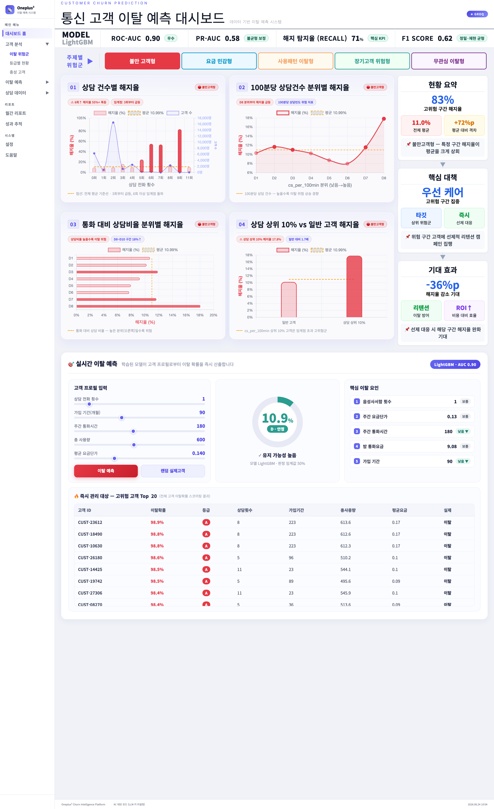
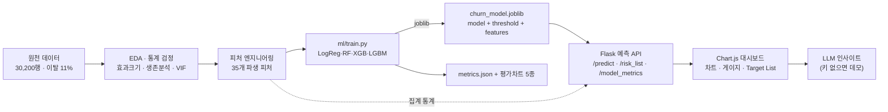
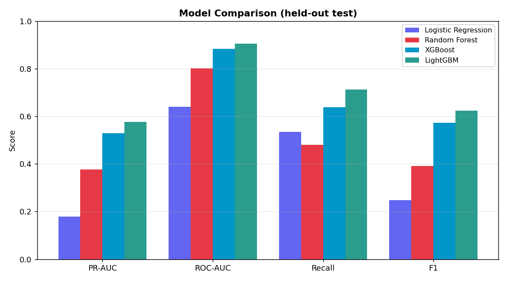
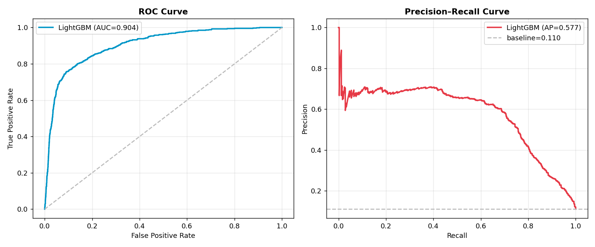
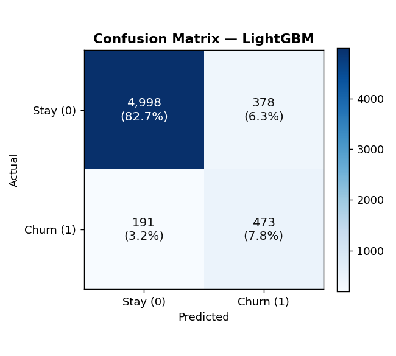
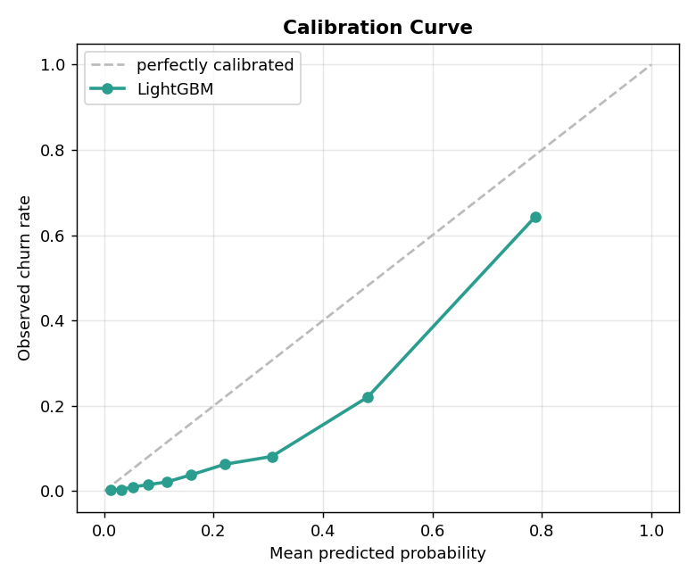
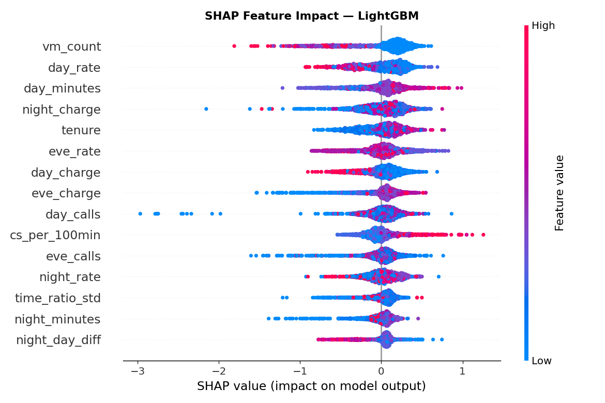

<div align="center">

# 📡 통신 고객 이탈 예측 시스템 · Churn Intelligence Platform

**가설 기반 EDA → 통계 검정 → 피처 엔지니어링 → 다중 모델링 → 실시간 예측 대시보드 + LLM 인사이트**

데이터 분석부터 모델 서빙·웹 서비스까지 한 흐름으로 연결한 **End-to-End 이탈 예측 포트폴리오**

<br/>


<br/>

### [▶ 대시보드 바로가기 — `http://127.0.0.1:6001`](http://127.0.0.1:6001)

<sub>로컬에서 `python web/churn_main.py` 실행 후 위 링크 클릭 (또는 아래 화면 클릭)</sub>

</div>

<br/>

<div align="center">
  <a href="http://127.0.0.1:6001">
    
  </a>
  <br/>
  <sub>▲ 실시간 이탈 예측 대시보드 — 5개 주제 분석 차트 · 라이브 예측 콘솔 · 고위험 고객 Target List · LLM 인사이트</sub>
</div>

---

## 📌 한눈에 보기

| 항목 | 내용 |
|---|---|
| **문제** | 통신사 고객 **이탈(Churn) 예측** — 30,198명, 이탈률 **11%** (클래스 불균형) |
| **핵심 모델** | **LightGBM** · ROC-AUC **0.904** · 해지 탐지율(Recall) **71%** · PR-AUC **0.577** |
| **데이터 분석** | Cohen's d · Cliff's δ · Mann–Whitney · 카이제곱 · VIF · **Kaplan–Meier 생존분석** |
| **서비스** | Flask 예측 API + Chart.js 대시보드(5 주제) + LightGBM 실시간 서빙 + Groq/Claude/Gemini LLM |
| **재현성** | `.venv` + 핀 고정 requirements · **DB·API 키 없이 데모 모드로 즉시 실행** · pytest 18종 |

> 학습된 모델을 직렬화해 **실시간 이탈 확률을 산출하는 예측 제품**으로, 누구나 클론 후 외부 서비스 없이 바로 실행할 수 있도록 설계했습니다.

---

## ✨ 주요 기능

- 🎯 **실시간 이탈 예측** — 고객 프로필(슬라이더)을 조정하면 학습된 LightGBM이 **이탈 확률·위험 등급(A~D)·핵심 요인**을 즉시 산출
- 🔥 **고위험 고객 Target List** — 전체 고객을 스코어링해 이탈 확률 상위 고객을 자동 추출(즉시 관리 대상)
- 📊 **5개 주제 가설 시각화** — 불만고객형·요금민감형·사용패턴형·장기고객형·무관심형, 7종 차트 렌더러
- 🤖 **LLM 인사이트 자동화** — Groq/Claude/Gemini 6슬롯 멀티 키 + 429 자동 페일오버, **키 없으면 데모 인사이트로 폴백**
- 📈 **모델 평가 리포트** — ROC/PR 곡선·혼동행렬·확률 캘리브레이션·SHAP 변수 기여도 자동 생성
- 🧪 **재현성 & 견고성** — 가상환경·핀 고정·`.env.example`·pytest, **DB/키 부재 시에도 절대 기동 실패 없음**

---

## 🏗️ 시스템 아키텍처

<div align="center">
  
</div>



---

## 🤖 모델 성능

4개 모델을 **불균형 보정**(class_weight / scale_pos_weight) 후 학습하고, 학습셋 교차검증으로 의사결정 임계값을 튜닝한 뒤 **홀드아웃 test(6,040명)** 에서 평가했습니다. 불균형 문제이므로 정확도 대신 **PR-AUC·Recall**을 핵심 지표로 사용했습니다.

| 모델 | ROC-AUC | PR-AUC | Recall | Precision | F1 |
|---|:---:|:---:|:---:|:---:|:---:|
| Logistic Regression | 0.640 | 0.178 | 0.535 | 0.161 | 0.248 |
| Random Forest | 0.801 | 0.376 | 0.480 | 0.329 | 0.391 |
| XGBoost | 0.883 | 0.529 | 0.639 | 0.519 | 0.573 |
| **🏆 LightGBM** | **0.904** | **0.577** | **0.712** | **0.556** | **0.624** |

> **선정 근거:** LightGBM이 모든 지표에서 최고. 실제 이탈자 **664명 중 473명(71%)을 사전 포착**(Brier 0.081로 확률 신뢰도 양호).

<div align="center">
  
  
  <br/>
  
  
  
  <br/>
  <sub>모델 비교 · ROC/PR 곡선 · 혼동행렬 · 확률 캘리브레이션 · SHAP 변수 기여도</sub>
</div>

---

## 🔬 분석 인사이트 (가설 검증)

단순 상관이 아니라 **효과크기 + 비모수 검정**으로 검증한, 반직관적인 이탈 신호 스토리입니다.

| 가설 | 결과 | 의미 |
|---|:---:|---|
| 상담비율 = 불만 밀도 | ⭐ **채택** (p≈10⁻⁷) | 불만 누적이 이탈의 최강 신호 |
| 요금 단가 체감 | **채택** | 요금 민감도가 이탈을 견인 |
| 가입 기간(단독) | **기각** | "오래 쓰면 충성" 통념 반박 — 상호작용에서만 유효 |
| 사용량 | **역전** | 고사용·장기 고객도 안심 금물 |

➡️ **결론:** 이탈은 *사용량 부족*이 아니라 **불만(상담) 누적 + 요금 체감**에서 온다.

---

## 🚀 빠른 시작 (Quickstart)

> **외부 서비스 불필요.** DB나 API 키 없이도 번들된 CSV + 데모 모드로 전체 대시보드가 동작합니다.

```bash
# 1) 저장소 클론
git clone <repo-url> && cd churn_semi_porject

# 2) 가상환경 (Python 3.10)
python3.10 -m venv .venv
source .venv/bin/activate            # Windows: .venv\Scripts\activate

# 3) 의존성 설치
pip install -r requirements.txt              # 앱 실행용
pip install -r requirements-dev.txt          # 모델 학습/분석/테스트까지

# 4) (선택) 모델 재학습 — 저장소에 학습된 모델이 이미 포함되어 있어 생략 가능
python ml/train.py

# 5) 대시보드 실행
python web/churn_main.py
#  → http://127.0.0.1:6001
```

<details>
<summary>💡 실제 DB / LLM 연동을 켜려면 (선택)</summary>

```bash
cp .env.example .env     # 생성된 .env 에 키/DB 정보 입력 (gitignore 처리됨)
```
- `DB_URL` 입력 시 → Oracle 우선 로드(미입력 시 CSV)
- `GROQ_API_KEY_1` 등 입력 시 → 실시간 LLM 인사이트(미입력 시 데모 인사이트)

> macOS에서 `xgboost`/`lightgbm` 로드 오류 시: `brew install libomp`
</details>

---

## 🧩 프로젝트 구조

```
churn_semi_porject/
├── data/churn/
│   ├── raw/                  # 원천 데이터 (train/test/sample_submission)
│   └── featured/churn.csv    # 피처 엔지니어링 완료 데이터셋 (30,198 × 36)
├── ml/
│   └── train.py              # 모델 학습·평가·직렬화 파이프라인
├── models/
│   ├── churn_model.joblib    # 직렬화된 LightGBM (model+threshold+features)
│   └── metrics.json          # 평가 지표
├── web/
│   ├── churn_main.py         # Flask 서버 + 라우트
│   ├── model_service.py      # 모델 서빙 레이어 (예측·리스크 스코어링)
│   ├── churn_ai.py           # LLM 인사이트 서비스 (멀티 키 + 데모 모드)
│   ├── churn_insert.py       # (선택) Oracle 적재 스크립트
│   ├── templates/dashboard_09.html
│   └── static/{css,js}/      # 대시보드 UI (topic.js · predict.js)
├── docs/                     # 아키텍처·평가차트·기획자료
├── notebooks/jh_EDA_FINAL.ipynb   # EDA 분석 노트북
├── tests/test_smoke.py       # pytest 스모크 스위트 (18종)
├── requirements.txt          # 런타임 의존성 (핀 고정)
├── requirements-dev.txt      # 학습/분석/테스트 의존성
├── .env.example              # 환경변수 템플릿
└── legacy/                   # 이전 개발 버전 보관 (참고용)
```

---

## 🔌 API 엔드포인트

| 메서드 | 경로 | 설명 |
|---|---|---|
| `GET`  | `/` | 대시보드 페이지 |
| `POST` | `/get_all_data` | 주제(A~E)별 차트 데이터 |
| `GET`  | `/model_metrics` | 학습 모델 지표 (KPI 바) |
| `POST` | `/predict` | 고객 프로필 → 이탈 확률·등급·요인 |
| `GET`  | `/predict_sample` | 실제 고객 1명 샘플 예측 |
| `GET`  | `/risk_list?n=` | 고위험 고객 Top-N (Target List) |
| `POST` | `/ai_topic_insight` | 주제별 LLM 인사이트(현황·대책·효과) |
| `GET`  | `/ai_usage` | LLM 키/데모 상태 |

---

## 🛠️ 기술 스택

| 영역 | 기술 |
|---|---|
| **언어** | Python 3.10 |
| **ML** | scikit-learn · LightGBM · XGBoost · SHAP · lifelines |
| **백엔드** | Flask · SQLAlchemy · oracledb(선택) |
| **프론트엔드** | HTML5 · CSS3 · JavaScript · Chart.js 4 |
| **LLM** | Groq(Llama 3.3) · Anthropic Claude · Google Gemini |
| **품질** | pytest · 가상환경 · 핀 고정 requirements |

---

## 🧪 테스트

```bash
pytest -q          # 18 passed — 데이터 로드 · 차트 라우트 · 모델 서빙 · AI 데모 모드
```

---

## 👥 팀 & 역할

| 역할 | 담당 |
|---|---|
| 모델링 | 어창선 (팀장) |
| EDA · 전처리 | 한정현 |
| 시각화 | 김나연 |
| 기획 · 발표 | 김효중 |

<div align="center"><sub>Oneplus³ · Telco Churn Intelligence Platform</sub></div>
