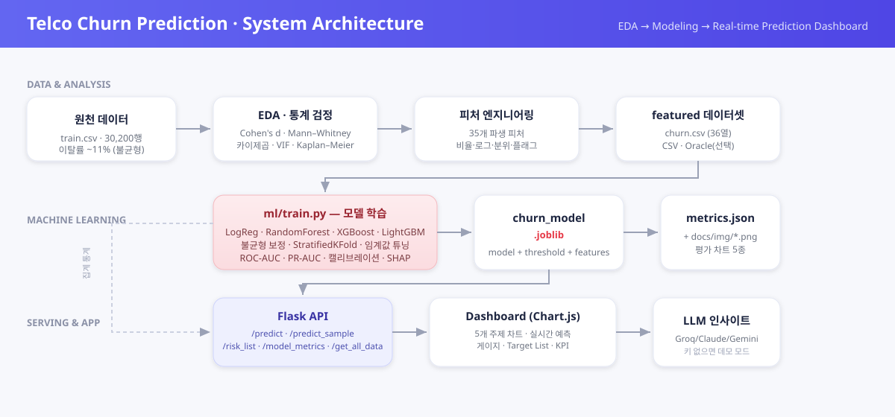

# 📈 분석 결과 & 통계적 근거

> README가 시스템·모델 전반을 다룬다면, 이 문서는 그 바탕이 된 **데이터 분석의 통계적 엄밀성**을 정리합니다.
> 가설 기반 EDA → 효과크기·비모수 검정 → 피처 엔지니어링 → 다중 모델링.

---

## 1. 파이프라인




---

## 2. 통계적 엄밀성 (코드 근거)

단순 상관이 아니라 **효과크기 + 비모수 검정**으로 신호의 크기와 유의성을 함께 검증했습니다.

| 기법 | 용도 |
|---|---|
| Cohen's d · Cliff's δ | 그룹 간 차이의 **효과크기**(실질적 크기) 측정 |
| Mann–Whitney U | 비정규 분포에 강건한 **비모수 검정** |
| 카이제곱 (chi-square) | 범주형 변수와 이탈의 독립성 검정 |
| VIF | 피처 간 **다중공선성** 진단 |
| Kaplan–Meier (lifelines) | 가입 기간에 따른 **생존(잔존) 분석** |
| Risk Ratio | 그룹별 이탈 위험비 |

---

## 3. 핵심 인사이트 (가설 검증)

| 가설 | 결과 | 의미 |
|---|---|---|
| 상담비율 = 불만 밀도 | ⭐ 채택 (p≈10⁻⁷) | 불만 누적이 이탈의 최강 신호 |
| 요금 단가 체감 | 채택 | 요금 민감도가 이탈을 견인 |
| 가입 기간(단독) | 기각 | "오래 쓰면 충성" 통념 반박 |
| 사용량 | 역전 | 고사용·장기 고객도 안심 금물 |

➡️ **결론:** 이탈은 *사용량 부족*이 아니라 **불만(상담) 누적 + 요금 체감**에서 온다.

---

## 4. 모델링 결과

불균형(이탈 11%) 보정 후 4개 모델을 **RepeatedStratifiedKFold(5×2)** 로 비교 — 정확도 대신 **PR-AUC** 중심.

| 모델 | CV PR-AUC | CV ROC-AUC |
|---|:---:|:---:|
| Logistic Regression | 0.179 ± 0.008 | 0.640 ± 0.009 |
| Random Forest | 0.392 ± 0.024 | 0.804 ± 0.011 |
| XGBoost | 0.536 ± 0.022 | 0.871 ± 0.009 |
| **LightGBM** | **0.567 ± 0.020** | **0.887 ± 0.009** |

**최종(LightGBM · isotonic 보정) — 홀드아웃 test:** ROC-AUC **0.906** · PR-AUC **0.581** · Recall **0.771** · F1 0.589 · Brier **0.060**

- **도메인 적합 운영점** — 이탈 방지는 미탐(FN) 비용이 크므로 **recall 가중(F2)** 임계값 채택 → 이탈자 664명 중 **512명(77%)** 사전 포착.
- **확률 보정** — isotonic 보정으로 Brier **0.081→0.060**, 예측 확률이 실제 빈도와 정합.
- **서빙** — 보정 모델을 `models/churn_model.joblib`로 직렬화 → 대시보드 `/predict` 실시간 산출.

### 🔎 검증 엄밀성 (분석 로직)
- **누수 진단** — 완전중복행 0건, 피처-타깃 최대상관 0.078 → 성능은 누수가 아닌 *약신호 상호작용* (과적합 갭 ROC 0.09).
- **누수 안전 피처** — 전수 데이터 기반 전도적 분위·플래그 5종 + 완전중복(`cs_ratio`=`cs_per_100min`) 제외(35→29).
- **천장 검증** — RandomizedSearch·앙상블·범주형 인코딩 모두 개선 없음 → 데이터 실질 한계 근접을 실험으로 입증.
- **누수 없는 임계값** — test가 아닌 dev 교차예측(OOF)에서 선택.

---

## 5. 한계 & 후속 과제 (정직 기록)

- 🟡 **본질적 예측 한계** — 피처-타깃 신호가 약해 PR-AUC 천장이 ~0.60. 추가 외부 데이터(요금제·약정·민원 텍스트) 확보가 다음 레버.
- 🟡 **시간 분할 검증** — 무작위 분할 기반. 실서비스에서는 시점 분할(time-based split)로 누수 점검 필요.
- 🟡 **비즈니스 임팩트 정량화** — 이탈 1명 방지 가치 × Recall 향상 = 기대 절감액 산출은 추정 단계.
- ✅ **재현성/보안** — 가상환경 + 핀 고정 requirements + `.env.example`(키 미커밋), DB·키 없이 데모 모드 실행.

---

## 6. 재현

```bash
pip install -r requirements.txt -r requirements-dev.txt
python ml/train.py            # 모델 재학습 (저장소에 학습본 포함, 생략 가능)
python web/churn_main.py      # 예측 대시보드 → http://127.0.0.1:6001
```
`.env`(GROQ/CLAUDE/GEMINI 키, DB)는 로컬 보관(커밋 금지) — 미설정 시 데모 모드.
